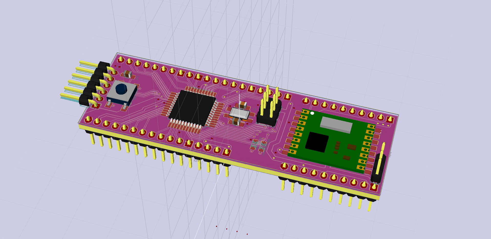
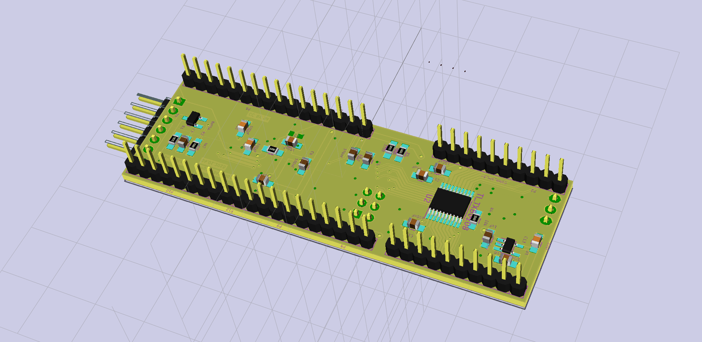

# Mega1284RFM69_PCB
arduino compatible, breadboard friendly board with
* ATmega1284p
* bidirectional 5V-3v3 level shifter (TI TXB0108)
* HopeRF RFM69HW 433MHz module

(original for Lumifluidus Prototyp)

<!-- file format / software information -->
## used software:  
    Application: kicad  
    Version: (2014-12-26 BZR 5338)-product Release build  
    wxWidgets: Version 3.0.0 (debug,wchar_t,compiler with C++ ABI 1002,GCC 4.8.2,wx containers,compatible with 2.8)    
    Platform: Windows 7 (build 7601, Service Pack 1), 64-bit edition, 64 bit, Little endian, wxMSW  
    Boost version: 1.54.0  
        USE_WX_GRAPHICS_CONTEXT=OFF  
        USE_WX_OVERLAY=OFF  
        KICAD_SCRIPTING=ON  
        KICAD_SCRIPTING_MODULES=ON  
        KICAD_SCRIPTING_WXPYTHON=ON  
        USE_FP_LIB_TABLE=HARD_CODED_ON  
        BUILD_GITHUB_PLUGIN=ON
    Inkscape 0.91 r13725

<!-- License info -->
   
LED Board PCB by [Stefan Krüger (s-light)](https://github.com/s-light/Mega1284RFM69_PCB) is licensed under a  
[Creative Commons Attribution 4.0 International License](http://creativecommons.org/licenses/by/4.0/).
